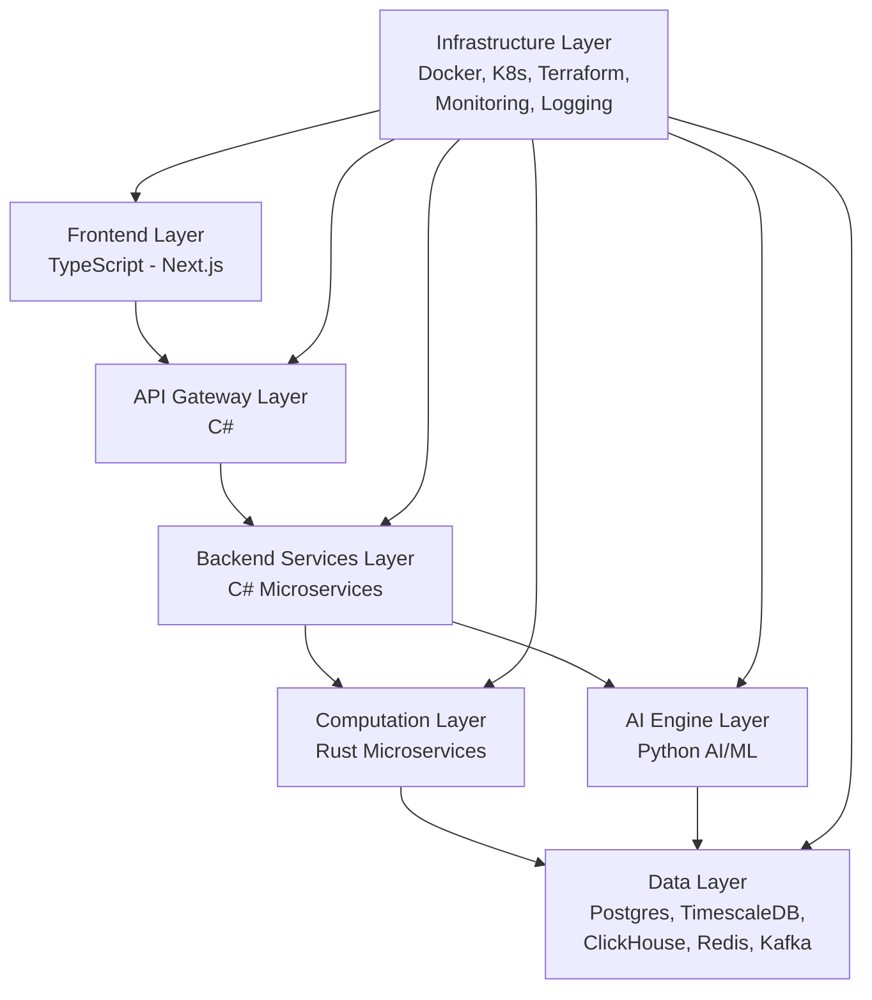

# High-Level Architecture

## Overview

The Crypto Analytics Platform is a scalable, AI-powered system for crypto market analytics and signal generation. The architecture is designed with modularity, performance, and scalability in mind, utilizing a microservices approach across different layers.

## Layers

### 1. Frontend Layer
- **Technology**: TypeScript (Next.js)
- **Components**: Web dashboard and mobile app
- **Responsibilities**: User interface, real-time data visualization, WebSocket connections for live updates

### 2. API Gateway Layer
- **Technology**: C#
- **Responsibilities**: Request routing, authentication, rate limiting, load balancing

### 3. Backend Services Layer
- **Technology**: C# (Microservices)
- **Services**:
  - Auth Service: User authentication and authorization
  - User Service: User profile management
  - Subscription Service: Subscription and billing
  - Signal Service: Signal processing and delivery
  - Admin Service: Administrative functions
- **Responsibilities**: Business logic, API endpoints, integration with other layers

### 4. Computation Layer
- **Technology**: Rust (Microservices)
- **Services**:
  - Market Ingestion: Real-time market data collection
  - Indicator Engine: Technical indicator calculations
  - Structure Engine: Market structure analysis
  - Orderblock Engine: Order block detection
  - Signal Engine: Signal generation
  - Risk Engine: Risk assessment
  - Backtest Engine: Historical backtesting
- **Responsibilities**: High-performance computations, data processing

### 5. AI Engine Layer
- **Technology**: Python
- **Components**: Feature engineering, model training, evaluation, registry, reinforcement learning
- **Responsibilities**: Machine learning models for predictive analytics, signal enhancement

### 6. Data Layer
- **Technologies**: PostgreSQL, TimescaleDB, ClickHouse, Redis, Kafka
- **Responsibilities**: Data storage, caching, event streaming, time-series data

### 7. Infrastructure Layer
- **Technologies**: Docker, Kubernetes, Terraform, Monitoring, Logging
- **Responsibilities**: Containerization, orchestration, infrastructure provisioning, observability

## Architecture Diagram

## Data Flow

1. Users interact with the Frontend.
2. Requests go through API Gateway to Backend Services.
3. Backend Services coordinate with Computation Layer for analytics and AI Engine for predictions.
4. Data is stored/retrieved from Data Layer.
5. Infrastructure supports deployment and monitoring.

This architecture ensures scalability, performance, and maintainability for the platform.