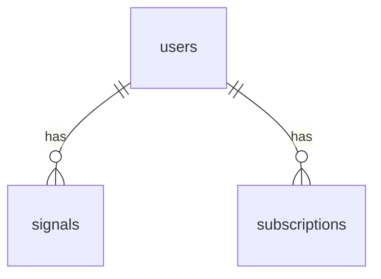

# Database Schemas and Data Models

## Overview

This document outlines the database schemas and data models for the Crypto Analytics Platform. The platform uses multiple data stores: PostgreSQL for relational data, TimescaleDB for time-series data, Redis for caching, and ClickHouse for analytical queries.

## PostgreSQL Schema

Used for users, signals, and subscriptions.

### Tables

#### users

| Field | Type | Constraints |
|-------|------|-------------|
| id | UUID | PRIMARY KEY |
| email | VARCHAR(255) | UNIQUE NOT NULL |
| password_hash | VARCHAR(255) | NOT NULL |
| created_at | TIMESTAMP | DEFAULT NOW() |
| updated_at | TIMESTAMP | DEFAULT NOW() |
| role | VARCHAR(50) | DEFAULT 'user' |

#### signals

| Field | Type | Constraints |
|-------|------|-------------|
| id | UUID | PRIMARY KEY |
| user_id | UUID | REFERENCES users(id) ON DELETE CASCADE |
| type | VARCHAR(50) | NOT NULL |
| symbol | VARCHAR(50) | NOT NULL |
| data | JSONB | |
| created_at | TIMESTAMP | DEFAULT NOW() |

#### subscriptions

| Field | Type | Constraints |
|-------|------|-------------|
| id | UUID | PRIMARY KEY |
| user_id | UUID | REFERENCES users(id) ON DELETE CASCADE |
| plan | VARCHAR(100) | NOT NULL |
| start_date | DATE | NOT NULL |
| end_date | DATE | |
| status | VARCHAR(50) | DEFAULT 'active' |

### Relationships

- signals.user_id -> users.id (Many-to-One)
- subscriptions.user_id -> users.id (Many-to-One)

### ER Diagram

## TimescaleDB Schema

Used for OHLCV time-series data.

### Table: ohlcv

| Field | Type | Constraints |
|-------|------|-------------|
| symbol | VARCHAR(50) | NOT NULL |
| timestamp | TIMESTAMPTZ | NOT NULL |
| open | DECIMAL(20,8) | NOT NULL |
| high | DECIMAL(20,8) | NOT NULL |
| low | DECIMAL(20,8) | NOT NULL |
| close | DECIMAL(20,8) | NOT NULL |
| volume | DECIMAL(20,8) | NOT NULL |

Primary Key: (symbol, timestamp)

Hypertable: Partitioned by timestamp.

## Redis Cache Structures

Redis is used for caching to improve performance.

### Key Patterns

- Session data: `session:{user_id}` -> JSON string {token, expiry}
- User signals cache: `signals:{user_id}` -> JSON array of signals
- OHLCV cache: `ohlcv:{symbol}:{interval}` -> JSON array of OHLCV records

## Other Data Stores

### ClickHouse

Used for fast analytical queries on aggregated data.

#### Table: daily_ohlcv

| Field | Type |
|-------|------|
| symbol | String |
| date | Date |
| open | Float64 |
| high | Float64 |
| low | Float64 |
| close | Float64 |
| volume | Float64 |

This is for daily aggregated OHLCV data.